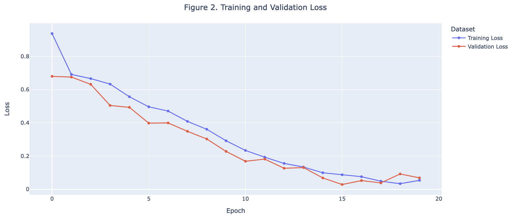
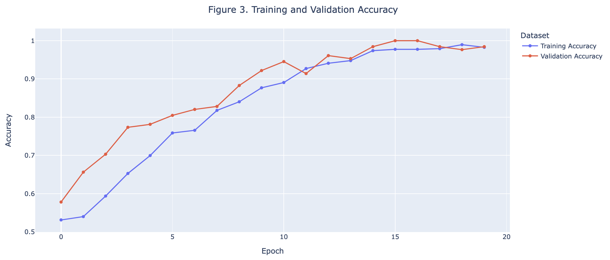
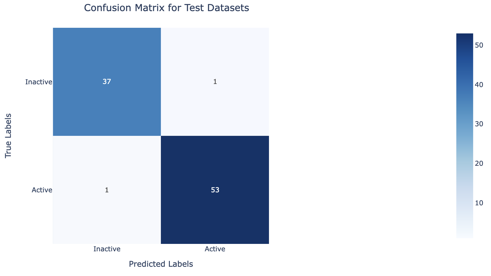

# Accelerating Targeted Drug Discovery Against Antibiotic Resistance with CNNs

## *Motivation*
Antibiotics are compounds that work by directly killing or inhibiting the growth of the bacteria. For instance, penicillin works by inhibiting an enzyme involved in cell wall synthesis. This weakens the overall integrity of the bacterial cell wall, making the bacteria more susceptible to osmotic pressure changes and resulting in cell lysis [^1]. While antibiotics have been effective for bacterial infections, some bacteria have been shown to contain β-lactamase, another enzyme that can break down and therefore inactivate these antibiotics, rendering them ineffective for bacterial infections [^1]. This allows the bacteria to continue to proliferate in the presence of antibiotics, leading to antibiotic resistance. Therefore, it is thought that inhibiting β-lactamase might be a viable option for preventing antibiotic resistance.

The hope is to develop an approach to help accelerate the discovery of β-lactamase inhibitors that effectively combat antibiotic resistance. While traditional drug discovery methodologies have predominantly relied on quantitative structure-activity relationship (QSAR) modeling [^2], most have primarily been based on 1D representations of molecular structure, with convolutional neural networks (CNNs) as a promising alternative. Unlike 1D descriptors, which often require manual selection and extraction of features [^3], CNNs can automatically extract hierarchical features from raw input data, such as 2D molecular structures [3]. This allows the CNN to capture both local and global patterns in molecular images, allowing for a more comprehensive representation of complex chemical structures and their relationships with biological activity [3]. By leveraging these capabilities, CNNs have the potential to improve predictive accuracy and enable more efficient drug discovery processes by directly learning from the molecular structure of the compounds [^3]. Here, a convolutional neural network trained on the chemical structure of compounds known to bind to β-lactamase to predict whether a future compound would be a strong candidate for inhibiting β-lactamase.

***NOTE:*** All steps performed in this project are viewable in `Beta_Lactamase_CNN.ipynb` and can be reproduced using the Google Colab link.

## *1. Preparing the Data*
A total of 136 csv files belonging to 136 different variants of the β-lactamase protein were recorded from the ChEMBL database (version 29) [^4]. For standardization, only compounds with recorded pChEMBL values, a metric describing how effectively the compound is at inhibiting β-lactamase, were selected. Compounds that had a standard deviation in pChEMBL value greater than 2 were also removed to ensure confidence in the compound's bioactivity. Duplicate rows of the same protein were removed by taking the average pChEMBL value across the filtered dataset, resulting in a total of 796 unique compounds. Lastly, compounds were defined as inactive or active based on how effective they were at inihibiting β-lactamase. Compounds whose pChEMBL value was greater than the median value of 5.48 were classified as active compounds (numerically as 1). Otherwise, they were classified as inactive compounds (numerically as 0).

The ChEMBL database also provides canonical SMILES for each compound, which is a unique string representation for that molecule. The canonical SMILES of the compounds were then converted into 256x256 images representing the molecular structure of the compound using a Python package called RDKit. To generate the training, validation, and testing datasets, the  entire dataset was randomly scrambled and split into batches of 64 compounds. Below are the number of compounds in each dataset:
- training dataset: 9 batches (576 compounds total)
- validation dataset: 2 batches (128 compounds total)
- testing dataset: 2 batches (128 compounds total)

## *2. Training the CNN*

With each iteration, the training and validation loss decreases, and by the 20th iteration, the loss is minimal (Figure 2). Similarly, the training and validation accuracies increase with each iteration, and by the 20th iteration, the CNN exhibits nearly perfect accuracy on both the training and validation sets (Figure 3). These all indicate that the CNN is learning to predict whether or not the compound can effectively inhibit β-lactamase based on the molecular structure of the compound. Additionally, the training and validation losses and accuracies are similar across all iterations (Figures 2 and 3), suggesting that the CNN is not overfitted. 

## *Evaluating the CNN*

The CNN was evaluated on the testing dataset, with results summarized in the confusion matrix above. The model correctly identified the majority of inactive and active compounds, with only one false positive and one false negative. This indicates that the CNN performs well and demonstrates a high level of accuracy. These results suggest that using images of molecular structures is a viable approach for predicting whether a drug candidate can effectively inhibit antibiotic resistance. Furthermore, this method may eliminate the need for extensive feature engineering, simplifying the predictive modeling process.

[^1]: C. L. Tooke *et al.*, “β-Lactamases and β-Lactamase Inhibitors in the 21st Century,” *J Mol Biol*, vol. 431, no. 18, pp. 3472–3500, Aug. 2019, doi: 10.1016/j.jmb.2019.04.002. Available: https://www.ncbi.nlm.nih.gov/pmc/articles/PMC6723624/

[^2]: A. Cherkasov *et al.*, “QSAR Modeling: Where Have You Been? Where Are You Going To?,” *J. Med. Chem.*, vol. 57, no. 12, pp. 4977–5010, Jun. 2014, doi: 10.1021/jm4004285. Available: https://pubs.acs.org/doi/10.1021/jm4004285

[^3]: M. Hirohara, Y. Saito, Y. Koda, K. Sato, and Y. Sakakibara, “Convolutional Neural Network Based On SMILES Representation of Compounds for Detecting Chemical Motif,” *BMC Bioinformatics*, vol. 19, no. 19, p. 526, Dec. 2018, doi: 10.1186/s12859-018-2523-5. Available: https://doi.org/10.1186/s12859-018-2523-5

[^4]: Dataset was downloaded from https://github.com/dataprofessor/beta-lactamase
